<style>

    section {
        /*background: #202228;
        color: #fff;*/
    }
    section.intro {
        text-align: center;
    }
    section:not(.intro){
        text-align:left;
        font-size: 1.5rem;
    }
    section:not(.intro) p {
        margin-bottom: 30px;
    }
    section img {
        display: block;
        margin: 0 auto;
    } 
    section li p img  {
        position: relative;
        left: -25px;
    }
    section ul {
        margin-left: 0;
    } 
</style>
<!-- _class: intro -->

### Time series forecasting: predviđanje rezervacija hotelskih soba

18.12.2019.

#### Romeo Šajina

---
# Prije svega

* Slikanje, snimanje?

* Iza ove grupe ne stoji nikakva firma (iako je Kristijan osnovao Meetup i ima firmu)

* Okupljamo se da radimo na zanimljivim i novim stvarima, zatim to prezentiramo

* Želite prezentirati nešto vezano za IT što pruža neku vrijednost ostalima? Dobrodošli.

* Ako imate ideje, trebate pomoć na nekom vašem području - javite se, bacite poruku na Facebook grupu, pošaljite poruku nekome od nas - vrlo je vjerojatno da vam možemo dati savijet, pomoći ili vas makar usmjeriti prema ljudima koji znaju kako to riješiti

* Dugoročni cilj: oformljavanje grupa koja rješava tekuće probleme ljudi


---
# Vremenski niz

* Najjednostavnija definicija: kronološki niz vrijednosti

* Zapravo sve što se može promatrati sekvencijalno tijekom vremena

* Najpoznatiji primjeri: 
    * cijena dionica
    * količina proizvedene električne energije
    * broj turista u zemlji ili nekoj drugoj jedinici
    * potrošnja određenih proizvoda
    * vrijednost BDP-a u zemlji
    * ...

---
# Zašto predviđati

* Točno predviđanje vremenskog niza je vrlo korisno jer omogućava poduzimanje pravovremenih mjera kako bi proces kojeg vremenski niz predstavlja bio što efikasniji

* Proizvođači električne energije žele što bolje predvidjeti koliko će se u nekom razdoblju potrošiti struje

* Kod rezervacija hotelskih soba je cilj prodati sobe po najvišim cijena ovisno o tržištu, odnosno ponudi i potražnji

---
# Korišteni podaci

* Podaci predstavljaju rezervacije soba za X hotela vodeće Hrvatske tvrtke kroz tri godine

* Podaci su organizirati tako da se rezervacije promatraju samo za neki određeni dan (npr. 1.7.)

* Zapravo, da bi se rezervacija uključila u promatrani skup, boravišno vrijeme gosta mora uključivati promatrani datum

* Napomena: jedna rezervacija može uključivati više soba, što je zapravo podatak koji se promatra

---
# Korišteni podaci - rezervacije za 01.07.

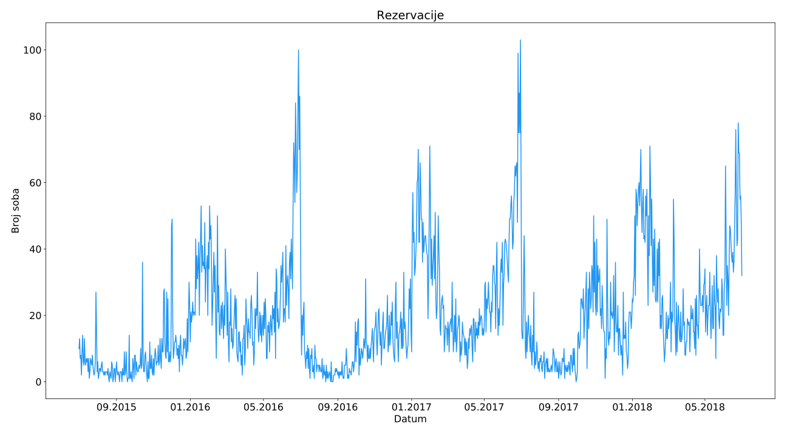

---
# Što ćemo predviđati

* Konkretan zahtjev tvrtke: previđanje rezervacija 60, 30 i 7 dana unatrag od promatranog datuma

* Ako promatramo datum 1.7., predviđanja će se raditi na datume 2.5., 1.6. i 24.7. sa dotada prikupljenim podacima.

---
# Što ćemo predviđati

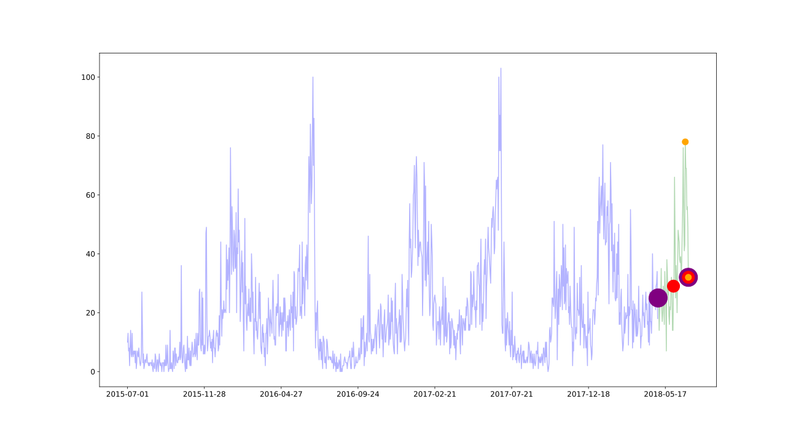

---
# Što ćemo predviđati

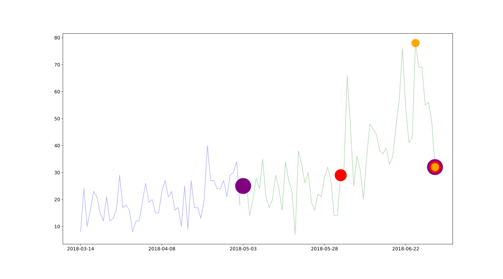

---

<!-- _class: intro -->

### Trend, sezonalnost i cikličnost

---
# Trend
* Može se prepoznati kada postoji dugoročno povećanje ili smanjenje u podacima

* U većini slučajeva jasno uočljiv, ali kada nije odmah uočljiv, to ne daje naznaku da trend ne postoji

* 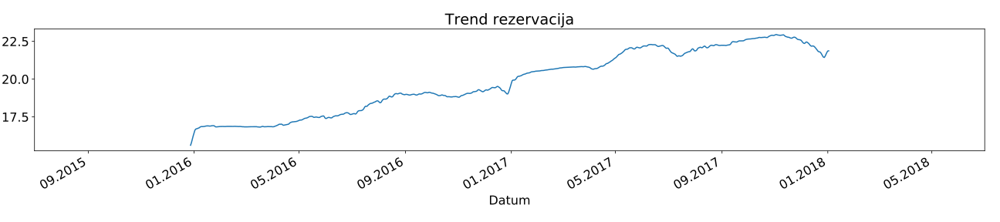

---
# Sezonalnost

* Nastaje kada na vremenski niz utječu sezonalni čimbenici kao što su doba godine ili dan u tjednu

* Uvijek ima fiksnu ili poznatu učestalost, odnosno frekvenciju

* U primjeru vremenskog niza rezervacija jasno se može vidjeti da postoji godišnja sezonalnost

---
# Sezonalnost

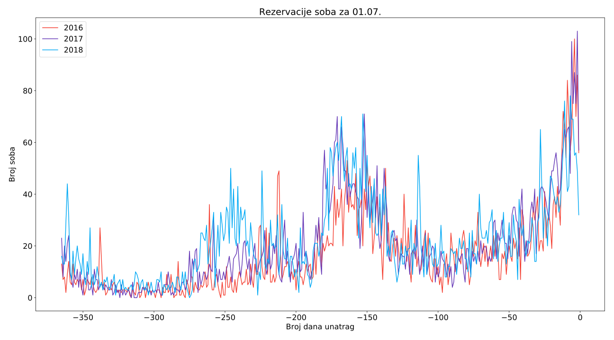

---
# Cikličnost
* Pojavljuje se kada se u podacima pojavljuju porast ili pad koji nisu fiksne učestalosti, odnosno frekvencije.

* Obično posljedica ekonomskih uvjeta i čestu su povezana sa „poslovnim ciklusom“

* Cikličnost je slična sezonalnosti u aspektu periodičnog ponavljanja uzorka, dok je različita u aspektu frekvencije, odnosno sezonalnost ima fiksnu frekvenciju dok cikličnost nema

* Nema slike :)

---
# Mjere točnosti

* Mean Absolute Error (MAE):

    * $MAE = \frac{1}{n} \displaystyle\sum_{t=1}^{n} |e_t|$
<br>
* Forecasting Attainment (FA):

    * $FA = \frac{\displaystyle\sum_{t=1}^{n} y_t'}{\displaystyle\sum_{t=1}^{n} y_t}$, gdje je $y_t'$ predviđena, a $y_t$ stvarna vrijednost

---

# Metode predviđanja

```json
{ 
    "01.01.2019.": 1,
    "01.02.2019.": 2,
    "01.03.2019.": 2,
    "01.04.2019.": 3,
    "01.05.2019.": 2,
}
```

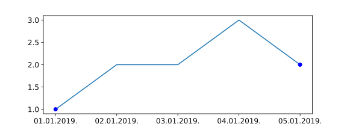

* Postoje dvije glavne metode predviđanja: jednokoračno i višekoračno


---
# Jednokoračno (engl. one-step)

* Za vremenski okvir $y_0,\dots, y_n$ predviđa $y_{n+1}$

* 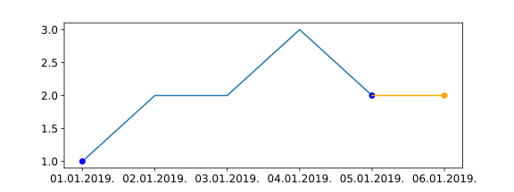

---
# Višekoračno (engl. multi-step)

* Za vremenski okvir $y_0,\dots, y_n$ iterativnim korištenjem jednokoračne metode predviđa $y_{n+1,\dots, y_{n+k}}$

* 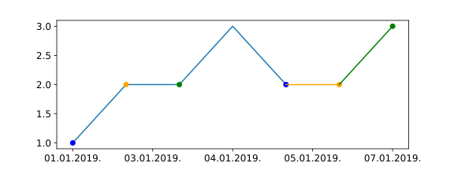

---
# Modeli predviđanja

* Postoji mnogo različitih metoda modeliranja vremenskih nizova

* Odabir pravog modela nije jednostavan

* Često se kod analize vremenskih nizova testira više različitih modela i promatraju njihove performanse

* Naive, AR, MA, ARIMA, Prophet, NN

---
<!-- _class: intro -->
### Naivni (engl. Naive/Persistent) modeli

---
# Naivni model

* Najjednostavnija izvedba naivnog modela: za predviđanje uzima posljednja dostupna vrijednost

* $y_t = y_{t-1}$

* Metoda radi izuzetno dobro za mnogo ekonomskih i financijskih vremenskih nizova 


---
# Naivni model


---
# Sezonalni naivni model

* Za predviđanje se može iskoristiti vrijednost iz prošle sezone u istom trenutku

* Npr. za predviđanje vrijednosti za dan 1.7.2019. može se koristiti vrijednost na dan 1.7.2018.

* $y_t = y_{t-m}$, gdje je $m$ trajanje sezonalnog razdoblja

---
# Sezonalni naivni model

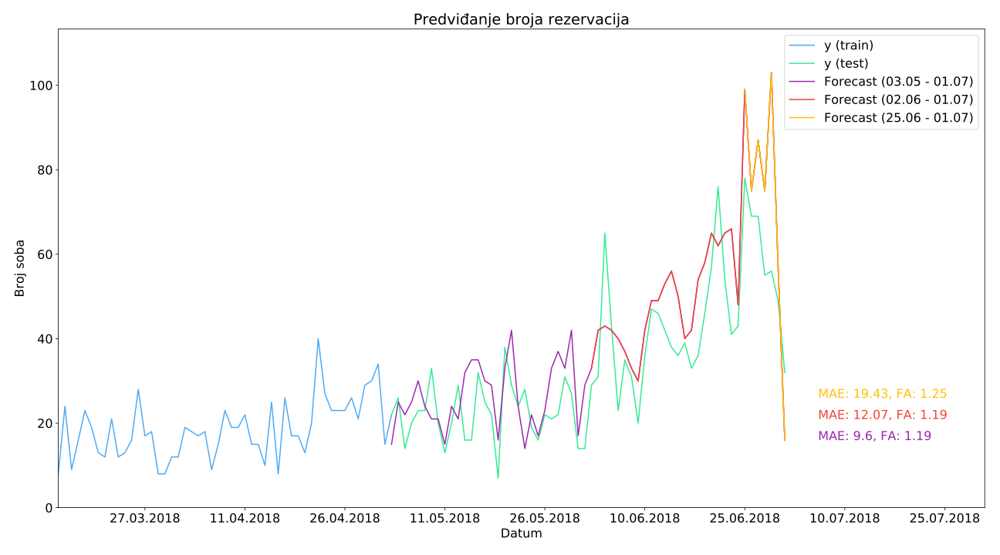

---
<!-- _class: intro -->
### Statistički modeli

---
# Autokorelacija

* Autokorelacija je blisko vezana sa korelacijom

* Kao što korelacija mjeri opseg linearnog odnosa između dvije varijable, tako autokorelacija mjeri linearni odnos između prethodnih vrijednosti vremenskog niza

*  Može se izračunati prema prethodnim vrijednostima koje se zovu vremenski pomaci (engl. lags)

* Prikaz autokorelacije vremenskog niza prema vremenskom pomaku zove se AutoCorrelation Function (ACF)

---
# Autokorelacija: ACF (Pearson)

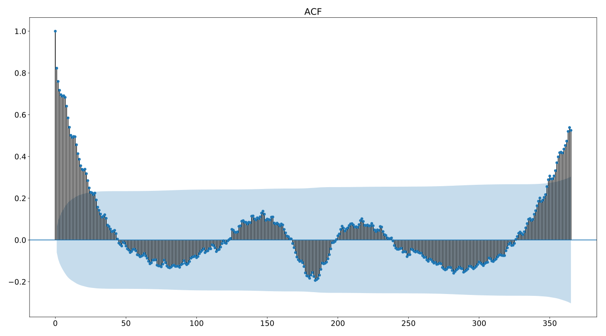

---
<style scoped>ul {list-style-type:none; margin:0 auto;}</style>
# Autokorelacija & Parcijalna autokorelacija

* 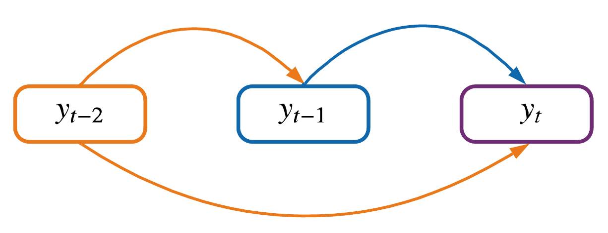
* 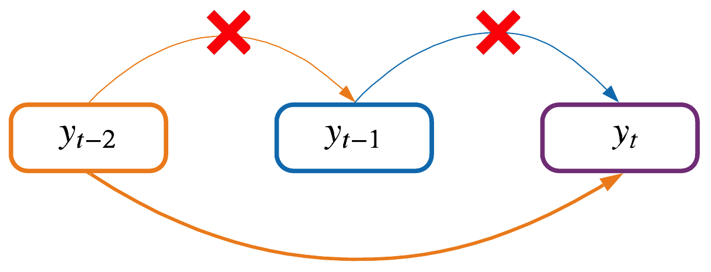

---
# Parcijalna autokorelacija

* Autokorelacija za promatranu vrijednost i vrijednost u nekom prethodnom koraku se sastoji od direktne korelacije i indirektne korelacije

* $y_{t-3}$ ima indirektnu korelaciju sa 
$y_{t-2}$ koji ima indirektnu korelaciju sa korakom 
$y_{t-1}$ koji ima direktnu korelaciju sa 
$y_t$

* Parcijalna autokorelacija želi ukloniti indirektne korelacije kako bi se mogla izračunati samo direktna korelacija između $y_t$ i $y_{t-k}$ gdje $k$ vremenski pomak

* Prikaz parcijalne autokorelacije vremenskog niza prema vremenskom pomaku zove se Partial AutoCorrelation Function (PACF)

---
# Parcijalna autokorelacija: PACF

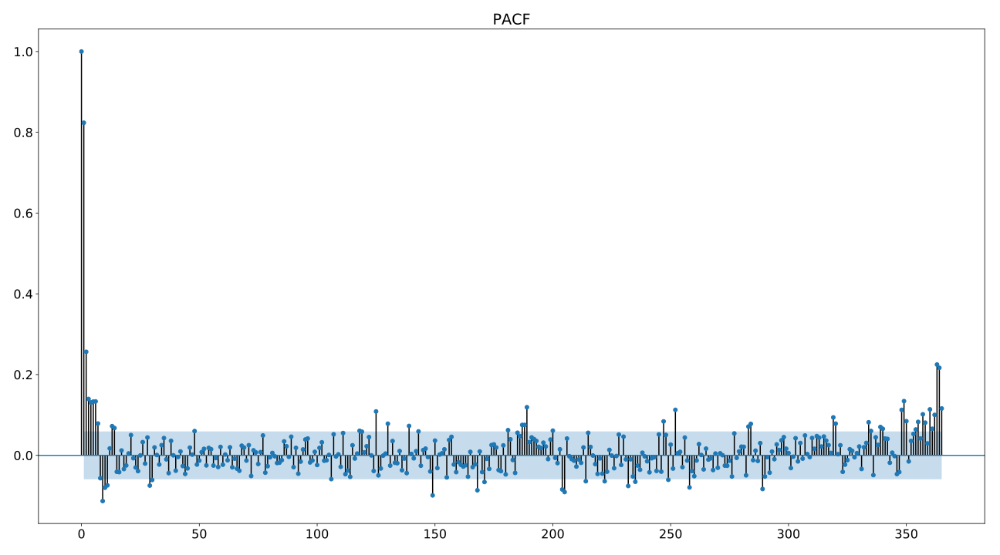

---
<style scoped>
    section strong {
        color: green;
    }
</style>
# Bijeli šum (engl. White noise)

* Vremenski niz koji nema autokorelaciju

* Kada je vremenski niz bijeli šum, autokorelacija će biti blizu $0$ i $95\%$ vrijednosti autokorelacije će biti unutar granica ACF prikaza

* Kod vremenskog niza rezervacija može se primijetiti da **nije** bijeli šum jer: 
    * postoji značajna autokorelacija do vremenskog pomaka 25

    * više od $5\%$ vrijednosti je izvan granice ACF prikaza

* Iako nije daleko da bude samo šum, onda nastavak prezentacije nema smisla

---
# Dekompozicija vremenskog niza

- Vremenski niz se sastoji od tri komponente:

    * trend-cikličnost 

    * sezonalnosti

    * preostalo (sadrži ostatak vremenskog niza) 

* Ova metoda se većinom koristi zbog boljeg razumijevanja vremenskog niza i izgradnje boljeg predikcijskog modela

---
# Dekompozicija vremenskog niza

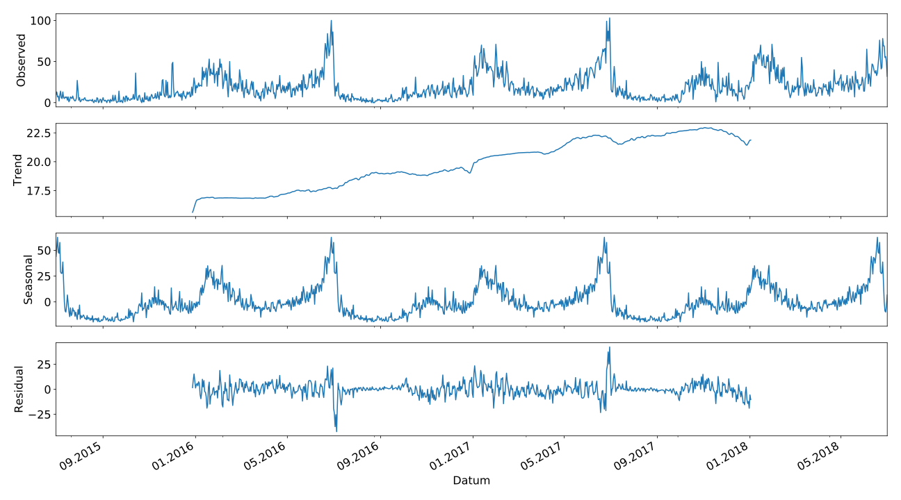


---
# Stacionarnost

* Stacionarni vremenski niz je onaj čija svojstva ne ovise o vremenu u kojem se vremenski niz promatra

* Provjera stacionarnosti je nužna kod izgradnje statističkog predikcijskog modela

* Ispitivanje kroz Augmented Dickey and Fuller (ADF) test
    * p-value > 0.05: prihvaća se hipotezada niz nije stacionaran

    * p-value <= 0.05: odbacuje se hipoteza da niz nije stacionaran

* Ako niz nije stacionaran potrebno je napraviti potrebne transformacije (npr. diferenciranje)

---
# Diferenciranje

* Diferenciranje izvršava transformaciju podataka izračunavajući razlike između uzastopnih opservacija

* Diferenciranje može pomoći stabilizirati srednju vrijednost vremenskog niza

* $y_{t-2} = y_{t-3} - y_{t-4}$
$y_{t-1} = y_{t-2} - y_{t-3}$
$y_{t} = y_{t-1} - y_{t-2}$


---
# Diferenciranje


---

# Vremenski niz rezervacija stacionaran?

* ADF test za primjer rezervacija iznosi $0.0013$

* Prihvaća se hipoteza da je vremenski niz stacionaran

* **Nije potrebno** izvršiti nikakvu transformaciju

---
# Autoregresivni model

* U autoregresivnim modelima predviđamo željenu varijablu koristeći linearnu kombinaciju njenih prethodnih vrijednosti

* Pojam autoregresija ukazuje da je to regresija varijable sa samom sobom

* $y_t=c+\phi_1y_{t-1}+\phi_2y_{t-2}+\ldots+\phi_py_{t-p}+\epsilon_t$,
gdje je $c$ konstanta, $\phi_1,\ldots,\phi_p$ su parametri vremenskih pomaka $y_{t-1},\ldots.y_{t-p}$, a $\epsilon_t$ opisuje bijeli šum

* ```model = AR(9)```

---
# Autoregresivni model

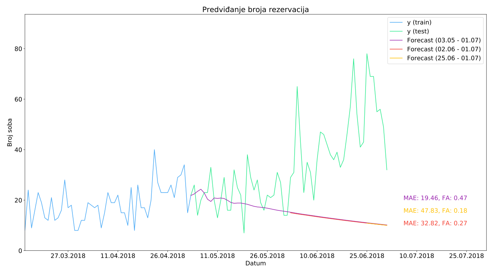

---
# Model pomičnih prosjeka

* Koriste greške dobivene previđanjem varijable u prošlosti, time dobivajući model sličan regresijskom modelu

* $y_t = c + \epsilon_t + \theta_1 \epsilon_{t-1} +  \theta_2 \epsilon_{t-2} + \ldots + \theta_q \epsilon_{t-q}$,
gdje je $c$ konstanta,  $\epsilon_t$ opisuje bijeli šum, $\theta1,\ldots,\theta_q$ su parametri grešaka $\epsilon_{t-1},\ldots,\epsilon_{t-q}$ predviđanja vremenskih pomaka, modela razine $q$

* ```model = MA(25)```

---
# Model pomičnih prosjeka

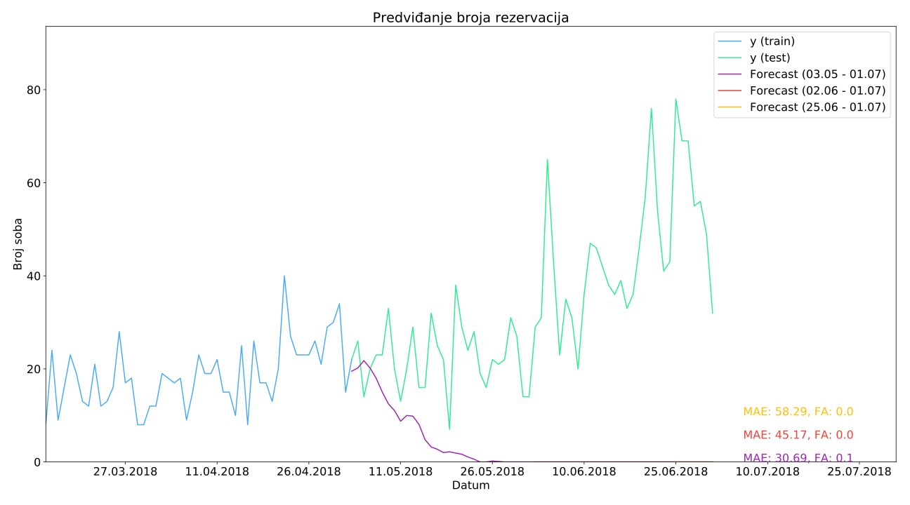

---
# ARIMA model

* Kombinacija diferenciranja, autoregresijskih modela i modela pomičnih prosjeka

* $y_t' = c + \phi_1 y_{t-1}' + \ldots + \phi_p y_{t-p}' + \theta_1 \epsilon_{t-1} + \ldots +  \theta_q \epsilon_{t-q} + \epsilon_t$,
gdje je $y_t'$ diferencirani niz koji može biti diferenciran više puta

* Formula definira **ARIMA(p, d, q)** model autoregresivnog dijela razine **p**, dijela pomičnih prosjeka razine **q** i stupnja diferenciranja **d**

* ```model = ARIMA(9, 0, 25)```

---
# ARIMA model

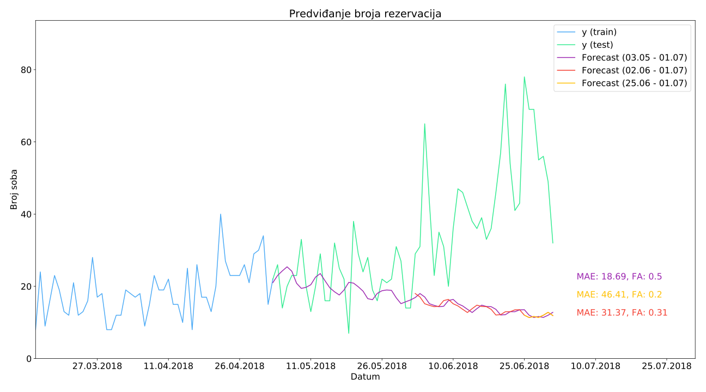

---
# SARIMA model

* Generalizirani ARIMA model koji može raditi sa sezonalnim vremenskim nizovima

* Formiran uključivanjem dodatnih sezonskih izraza u ARIMA model

* **ARIMA(p,d,q,)(P,D,Q)m**, gdje je **m** broj opservacija godišnje

* Zbog jednostavnosti i smanjivanja potrebe za ogromnim resursima prilikom treniranja koristiti će se model **ARIMA(1,0,1)(1,0,1)**

---
# SARIMA model

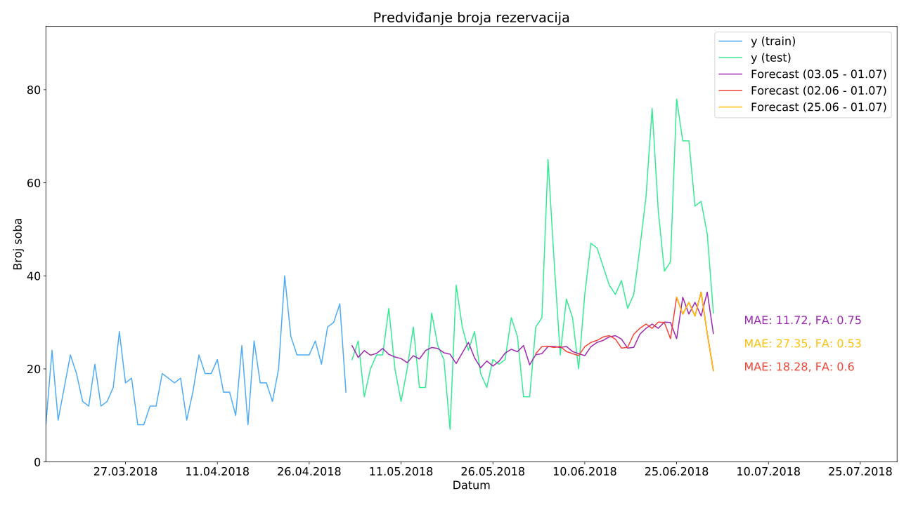

---
# Prophet model

* Razvio Facebook u svrhu predviđanja kretanja različitih vremenskih nizova:    
    * predviđanje broja izrađenih događaja na Facebook-u grupirano po danima u tjednu

* Koristi dekompozicijski model vremenskih nizova sa tri glavne komponente: trend, sezonalnost i praznici

* $y(t) = g(t) + s(t) + h(t) + \epsilon_t$

* Značajnije prednosti:
    * može pratiti više trendova
    * zapaža sezonalnost u podacima
    * uzima u obzir praznike i događaje

---
# Prophet model

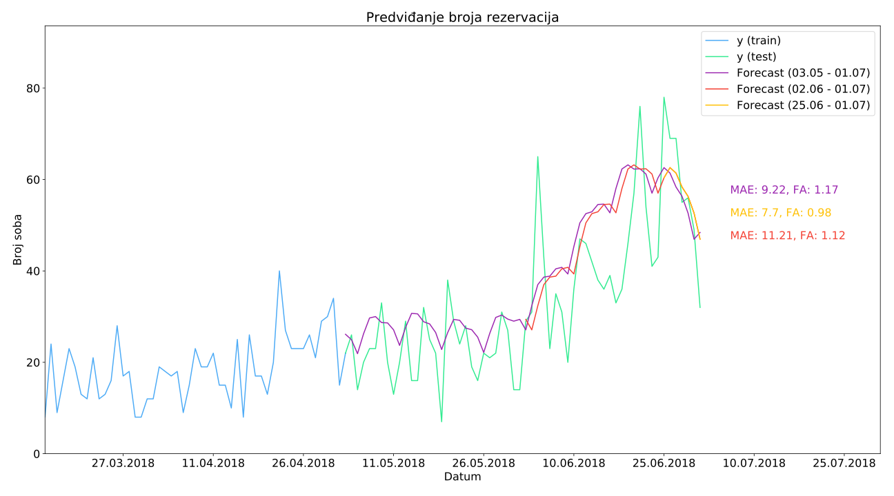

---
<!-- _class: intro -->
### Neuronske mreže

---
# Neuronske mreže

* Neuronske mreže (engl. Neural Network - NN) su trenutno možda i najpoznatija tehnika strojnog učenja

* Već uspješno primijenjene na probleme prepoznavanja slika, prepoznavanja govora, pretvaranja teksta u govor, a u novije vrijeme neuronske mreže su sposobne i generirati novi sadržaj (slika, tekst, zvuk)

* **Good news:** mogu se koristiti i za modele vremenskih nizova


---
# Neuronske mreže

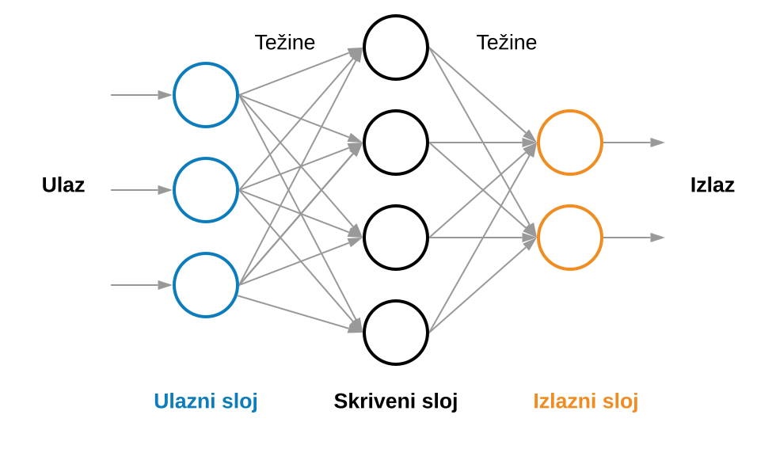

---
# Priprema podataka za treniranje NN

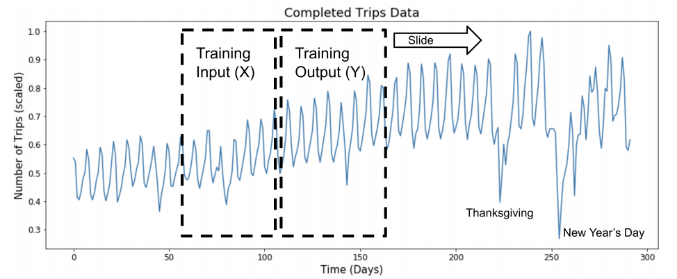

---
# Multilayer perceptron

* Najpoznatija i najjednostavnija vrsta neuronske mreže

* U MLP-u su svi neuroni sloja povezani sa svim neuronima sljedećeg sloja (engl. fully connected)

---
# Multilayer perceptron

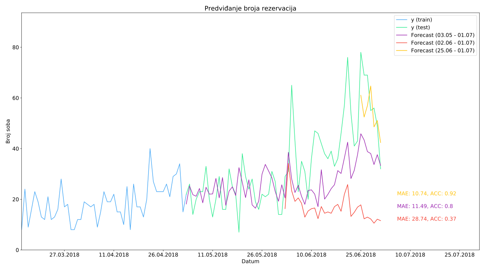

---
# Convolutional neural networks

* CNN su mreže specijalizirane za obradu podataka oblika rešetke

* Slike su idealan primjer takve strukture podataka, dok se tu mogu uvrstiti i vremenski nizovi koji se mogu promatrati kao jednodimenzionalni podaci

* Glavna prednosti CNN-a je mogućnost izvlačenja glavnih značajki kroz konvolucijske slojeve bez prethodne analize i pripreme podataka, već će one biti naučene kroz treniranje

* Sposobnost mreže da nauči prepoznavati ponovljene obrasce u vremenskom nizu, koje dalje može koristiti za predviđanje budućih vrijednosti

---
# Convolutional neural networks

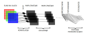

---
# Convolutional neural networks

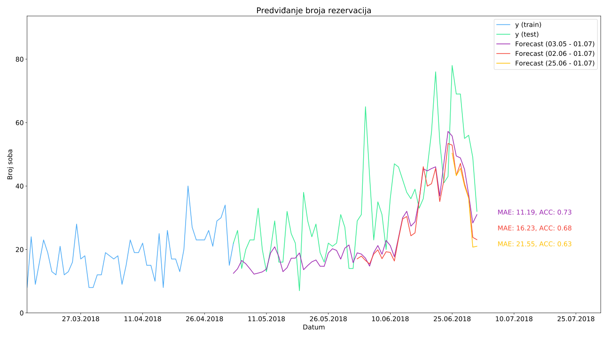

---
# Recurrent Neural Network

* Vrsta neuronske mreže koja je specijalizirana za obradu sekvencijskih nizova

* Omogućavaju obradu puno dužih nizova nego što bi to bilo moguće sa neuronskim mrežama koje nisu specijalizirane za obradu sekvencijskih nizova

* RNN sadrži sakrivena stanja koja su distribuirana kroz vrijeme, što omogućava spremanje mnogo informacija o prošlosti

* Izlaz ovisi o trenutnom ulazu, prethodnim ulazima, prethodnim izlazima i/ili skrivenim stanjima unutar mreže

* Dvije poznate implementacije: **LSTM** i **GRU**

---
# Recurrent Neural Network

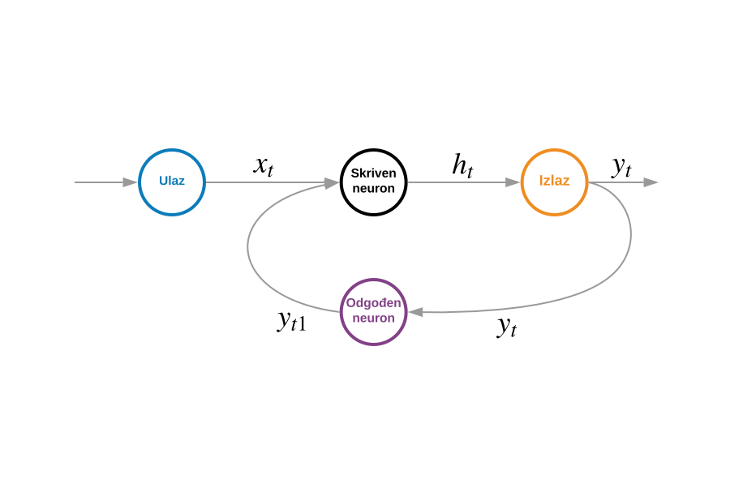


---
# LSTM

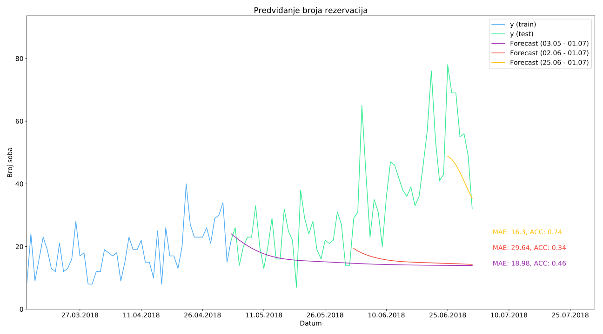

---
# GRU


---
<!-- _class: intro -->
### Autoencoder

---
# Autoencoder

* Neuronska mreža koja se trenira da kopira ulaz u izlaz

* Sastoji od dvije komponente: *encoder* koji enkodira podatke i *decoder* koji rekonstruira podatke

* Najpoznatiji način izvedbe *autoencoder*-a je mreža sa slojem između dvije komponente (*encoder* i *decoder*) koji ima manje dimenzije nego ulazni podaci

* Ideja je blisko vezana sa **PCA (engl. Principal Component Analysis)**

---

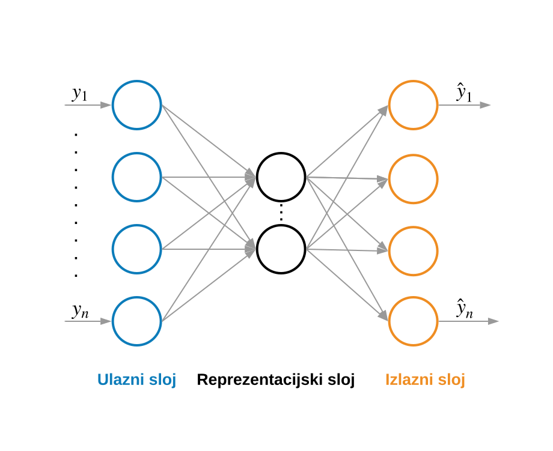

---
# Autoencoder MLP

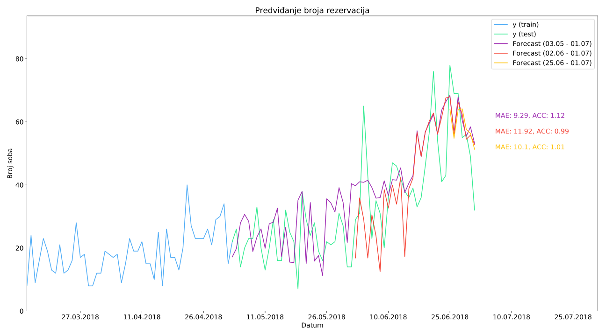

---
# Autoencoder CNN

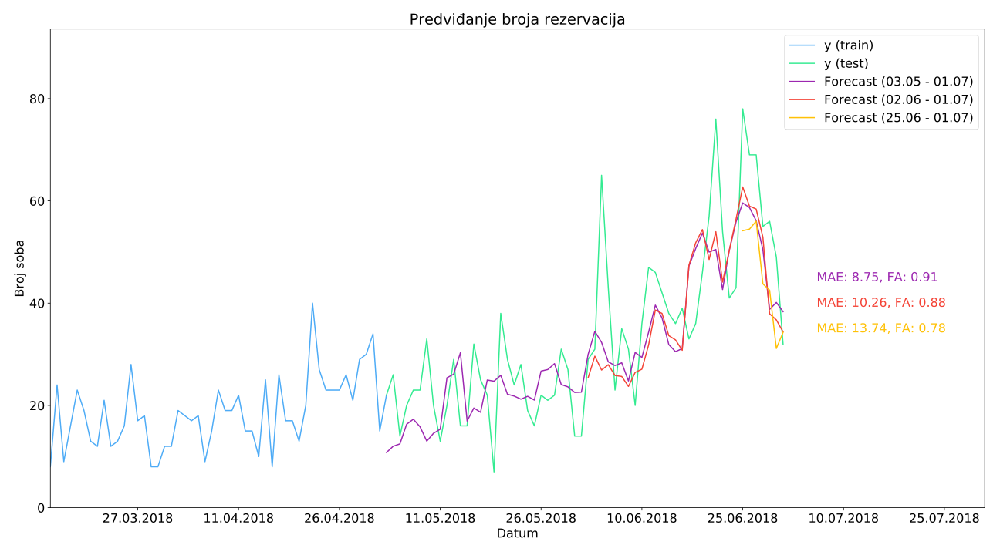

---
# Autoencoder MPL&LSTM

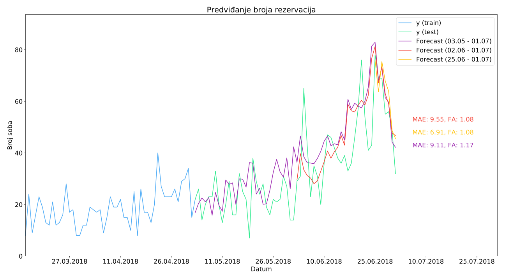

---
# Autoencoder MPL&GRU

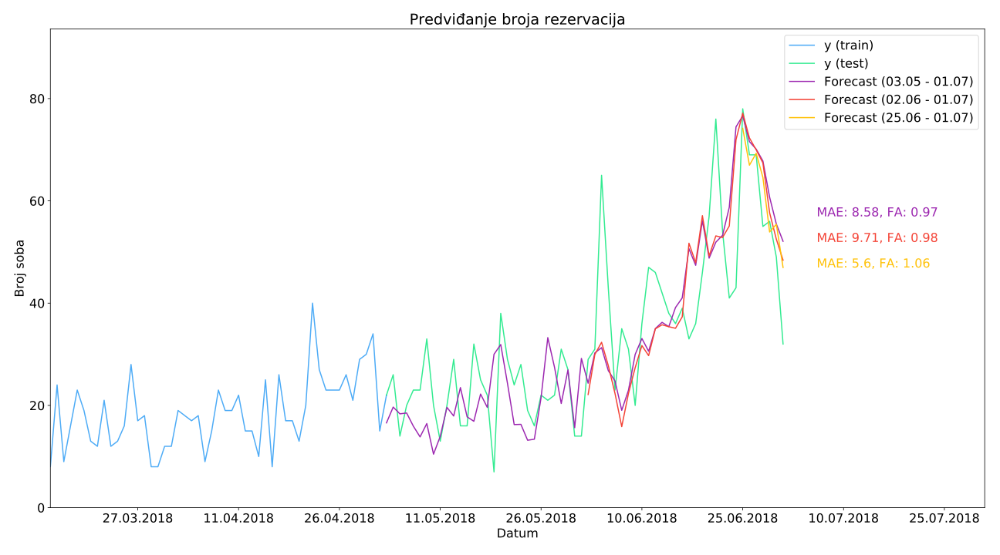

---
<style scoped> 
    section table {
        margin: 0;
    }
    section table td:first-child {
        width: 60%;
    }
</style>
# Konačni rezultati

| Model | AVG(MAE) | AVG(FA) |
|-------|----------|---------|
| SARIMA | 19.12 | 0.63    |
| Prophet | **9.38** | 1.09 | 
| MLP | 10.99 | 0.90 |
| CNN | **9.55** | 0.94 |
| LSTM | 12.59 | 0.88 |
| GRU | 11.80 | 0.99 |
| AutoencoderMLP | **9.39** | 1.08 |
| AutoencoderMLPLSTM | **8.52** | 1.11 |
| AutoencoderMLPGRU | $\color{green}{\textbf{7.96}}$| 1.00  |
